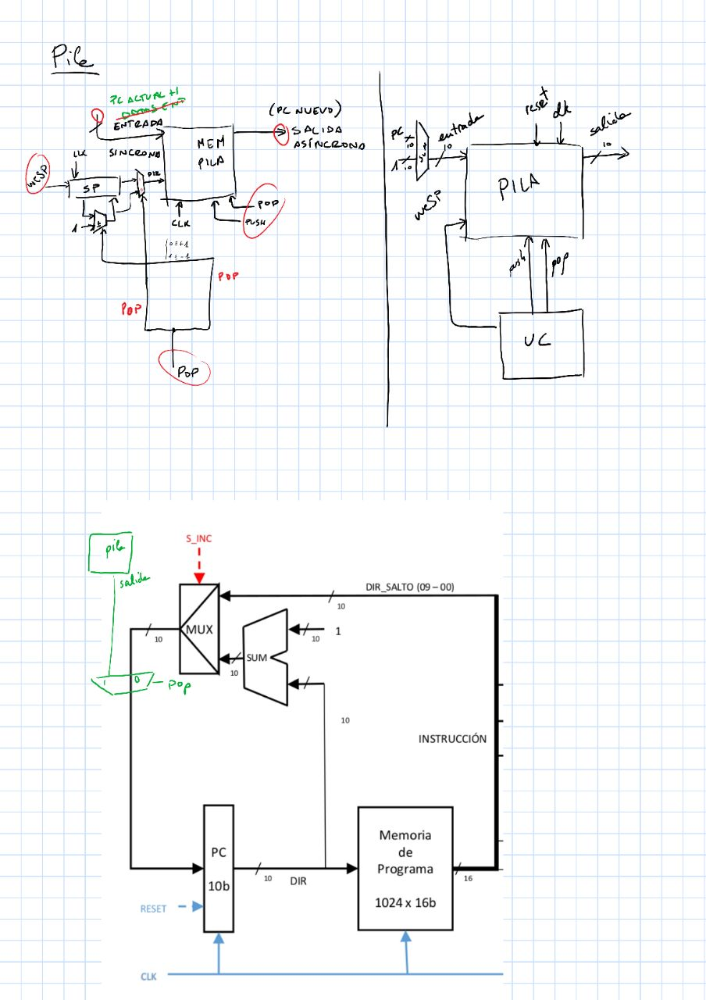
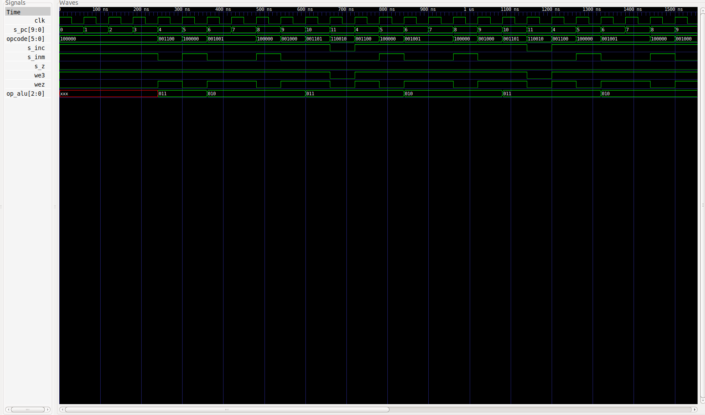

# PRÁCTICA 2: Diseño de una CPU monociclo

## Índice

1. [Objetivo](#objetivo)
2. [Mejoras](#mejoras)
3. [Compilación](#compilacion)
4. [Formato de palabra](#formatoPalabra)
5. [Instrucciones Implementadas](#microInstrucciones)
6. [Ejemplo del funcionamiento de la CPU monociclo base](#funcionamientoCPU)

## Objetivo<a name="objetivo"></a>

El objetivo de esta práctica es desarrollar una CPU básica monociclo, e implementarse mejoras a la misma. En concreto, esta CPU posee las siguientes características:

- Tiene una palabra de 16 bits (2 Bytes).
- Es capaz de trabajar con un máximo de 64 microinstrucciones, de las cuales 16 son instrucciones de salto, 4 son instrucciones de carga inmediata y 8 son instrucciones de la ALU.

- Posee una memoria de programa con un máximo de 1024 instrucciones. Esto implica que el programa que se desee ejecutar debe tener un máximo de 1024 instrucciones.
- El camino de datos de esta CPU es el siguiente:


## Mejoras<a name="mejoras"></a>

Estas son las mejoras que se han logrado implementar en este proyecto:

- Pila: Se ha dispuesto una pila exclusiva para realizar subrutinas. De esta forma, esta pila interna en la CPU es capaz de guardar la posición siguiente en la dirección del PC con el objetivo de recuperarla posteriormente. Para ello, se dispone de dos nuevas instrucciones: `PUSH` y `POP`. Pese a pertenecer a la codificación de los saltos, estas instrucciones no requieren de ningún dato adicional más all
á del OPCODE. Aquí disponemos una imagen con detalles sobre la implementación de la misma:



- Implementadas instrucciones `SKZ` y `SKNZ`. Estas instrucciones se encargan sencillamente de saltarse la siguiente instrucción del programa si se cumple la condición. Pertenece a la rama de las instrucciones de salto.

- Creado compilador para interpretar instrucciones utilizando etiquetas. Por ejemplo, la instrucción `LOAD 7 R1` el compilador la traduce a `1000_0000_0111_0001`. Además, tiene soporte para pseudo-instrucciones, de tal manera que la instrucción `BEQ R1 R2 DIR` se traduce como las instrucciones `SUB R1 R2 R0` y `JZ DIR`. La lista de pseudo-instrucciones implementadas en el compilador se incluyen en el apartado [Instrucciones implementadas](#microInstrucciones). Para que la CPU sea capaz de ejecutar el programa es necesario que el fichero se coloque en el directorio raíz con el nombre `progfile.dat`. Para ejecutar el compilador, use el siguiente comando en el directorio raíz del proyecto:

```bash

	./compilar program.as progfile.dat

```

- El compilador ahora soporta etiquetas para facilitarnos los saltos en el programa.

- Añadido flag que informa a la UC de que el resultado de la última operación de la ALU ha dado un valor negativo. Con esto, también se implementa la diferenciación de operaciones aritméticas en binario puro y en complemento a dos.

- Implementada instrucción JN, que habilita un salto a la dirección indicada si el flag de negativo está activo.

- Añadida pseudo-instrucciones `GOTO` y `RETURN` para ir a una subrutina y volver de ella respectivamente. Hacen uso de la pila para su funcionamiento.

## Compilación<a name="compilacion"></a>

Para compilar el proyecto, se debe situar la terminal en la raíz del mismo y ejecutar el siguiente comando:

```bash

	iverilog -c datafiles.txt -o cpu.out cpu_tb.v cpu.v

```

El fichero `datafiles.txt` contiene una lista de los ficheros `.v` necesarios para la correcta compilación del programa.

Este comando compilará el proyecto y generará el fichero `cpu.out`. Para poder ejecutar el fichero y ver el resultado con GTKWave, hacemos uso del comando `vvp cpu.out`. Esto generará el fichero `cpu_tb.vcd` el cual podemos utilizar para ver la ejecución de la CPU en GTKWave con el comando `gtkwave cpu_tb.vcd`.

Para poner a prueba esta CPU monociclo, **el programa debe ser escrito en el fichero progfile.dat**, en binario y siguiendo el formato de palabra indicado.

## Formato de palabra<a name="formatoPalabra"></a>

Como se ha mencionado antes, esta CPU es capaz de trabajar con un máximo de 64 instrucciones. El formato para cada instrucción es el siguiente:

- Instrucciones para salto:


- Instrucciones para carga inmediata


- Instrucciones para operaciones aritmético-lógica.


## Instrucciones implementadas<a name="microInstrucciones"></a>

Las instrucciones implementadas actualmente se representan en la siguiente tabla:

### Instrucciones de carga
| INSTRUCCIÓN      | OPCODE | DESCRIPCIÓN                               |
| :--------------: | :----: | :---------------------------------------- |
| **LOAD**         | 1000   | Carga un determinado valor en un registro |
| **??**           | 1001   | ??                                        |
| **??**           | 1010   | ??                                        |
| **??**           | 1011   | ??                                        |

### Instrucciones de salto
| INSTRUCCIÓN      | OPCODE | DESCRIPCIÓN                                                                             |
| :--------------: | :----: | :-------------------------------------------------------------------------------------- |
| **J**            | 110000 | Salto incondicional                                                                     |
| **JZ**           | 110001 | Salto si el flag de 0 está activo                                                       |
| **JNZ**          | 110010 | Salto si el flag de 0 **no** está activo                                                |
| **JN**           | 110011 | Salto si el flag de negativo está activo                                                |
| **PUSH**         | 110100 | Envía el valor siguiente de PC a la pila                                                |
| **POP**          | 110101 | Recupera el último dato ingresado y lo pone en PC                                       |
| **SKZ**          | 110110 | Se salta la siguiente instrucción del programa si el flag de Z está activo              |
| **SKNZ**         | 110111 | Se salta la siguiente instrucción del programa si el flag de Z **no** está activo       |
| **??**           | 111000 | ??                                                                                      |
| **??**           | 111001 | ??                                                                                      |
| **??**           | 111010 | ??                                                                                      |
| **??**           | 111011 | ??                                                                                      |
| **??**           | 111100 | ??                                                                                      |
| **??**           | 111101 | ??                                                                                      |
| **??**           | 111110 | ??                                                                                      |
| **??**           | 111111 | ??                                                                                      |

### Instrucciones aritmético-lógicas
| INSTRUCCIÓN      | OPCODE | DESCRIPCIÓN                               |
| :--------------: | :----: | :---------------------------------------- |
| **ADD**          | 0010   | Suma                                      |
| **SUB**          | 0011   | Resta                                     |
| **AND**          | 0100   | Operación AND entre los bits              |
| **OR**           | 0101   | Operación OR entre los bits               |
| **NOT**          | 0001   | Niega los bits del valor introducido      |
| **SELF**         | 0000   | Devuelve el mismo valor que el de entrada |
| **NFOP**         | 0110   | Niega el primer operando                  |
| **NSOP**         | 0111   | Niega el segundo operando                 |

### Pseudo-Instrucciones

Para utilizar estas instrucciones se debe hacer uso del compilador proporcionado.

| PSEUDO-INSTRUCCIÓN | INSTRUCCIONES NATIVAS EQUIVALENTES       | DESCRIPCIÓN                                                             |
| :----------------: | :---------------------------------       | :---------------------------------------------------------------------- |
| **BEQ** R1 R2 DIR  | **SUB** R1 R2 R0, **JZ** DIR             | Si los datos en R1 y en R2 son iguales, salta a la dirección DIR        |
| **BNE** R1 R2 DIR  | **SUB** R1 R2 R0, **JNZ** DIR            | Si los datos en R1 y en R2 **no** son iguales, salta a la dirección DIR |
| **BLT** R1 R2 DIR  | **SUB** R1 R2 R0, **JN** DIR             | Si el valor en R1 es menor que R2, salta a la dirección DIR             |
| **BLE** R1 R2 DIR  | **SUB** R1 R2 R0, **JN** DIR, **JZ** DIR | Si el valor en R1 es menor **o igual** que R2, salta a la dirección DIR |
| **BGT** R1 R2 DIR  | **SUB** R2 R1 R0, **JN** DIR             | Si el valor en R1 es mayor que R2, salta a la dirección DIR             |
| **BGE** R1 R2 DIR  | **SUB** R2 R1 R0, **JN** DIR, **JZ** DIR | Si el valor en R1 es mayor **o igual** que R2, salta a la direcicón DIR |
| **GOTO** DIR	     | **PUSH**, **J** DIR			| Salta a una subrutina, en la dirección DIR                              |
| **RETURN**         | **POP**                                  | Vuelve de la subrutina para retomar la ejecución                        |

Como se puede observar, el repertorio de instrucciones de salto y de carga inmediata puede ser ampliado.

## Ejemplo del funcionamiento de la CPU monociclo base<a name="funcionamientoCPU"></a>

Este ejemplo corresponde a la CPU base solicitada para la práctica.

El código que se ejecuta en la prueba es el siguiente:

### Código en C++
```C

	int main (void) {
		int sum = 0;

		for (int i = 0; i != 4; i++) {
			sum += (10 - i) + 1;
		}
	}

```

### Código en microinstrucciones de nuestra CPU monociclo
| DIR     | CÓDIGO CON ETIQUETAS | CÓDIGO EN BINARIO       |
| :-----: | :------------------- | :---------------------: |
| **0**   | **LOAD** 0, R1       | **1000** 0000 0000 0001 |
| **1**   | **LOAD** 10, R2      | **1000** 0000 1010 0010 |
| **2**   | **LOAD** 0, R3       | **1000** 0000 0000 0011 |
| **3**   | **LOAD** 4, R7       | **1000** 0000 0100 0111 |
| **4**   | **SUB** R2, R3, R4   | **0011** 0010 0011 0100 |
| **5**   | **LOAD** 1, R5       | **1000** 0000 0001 0101 |
| **6**   | **ADD** R4, R5, R5   | **0010** 0100 0101 0101 |
| **7**   | **ADD** R5, R1, R1   | **0010** 0101 0001 0001 |
| **8**   | **LOAD** 1, R5       | **1000** 0000 0001 0101 |
| **9**   | **ADD** R3, R5, R3   | **0010** 0011 0101 0011 |
| **10**  | **SUB** R7, R3, R8   | **0011** 0111 0011 1000 |
| **11**  | **JNZ** 4            | **1000 10**00 0000 0100 |
| **12**  | **ADD** R1, R0, R1   | **0010** 0001 0000 0001 |

**NOTAS**:
- El OPCODE viene destacado en negrita.
- La última instrucción se realiza para que el resultado de la suma se refleje en la salida de la ALU, pudiéndose ver en el GTKWave. El resultado de la variable `sum` es 38.

### Resultado del GTKWave
Como se puede observar en la captura de pantalla, se realiza un salto entre la instrucción en la dirección 11 y la 4. Esto ocurre hasta el final, en el cual acaba sumando la variable `sum` con 0, de forma que el resultado de la suma acabe en la salida de la ALU.


